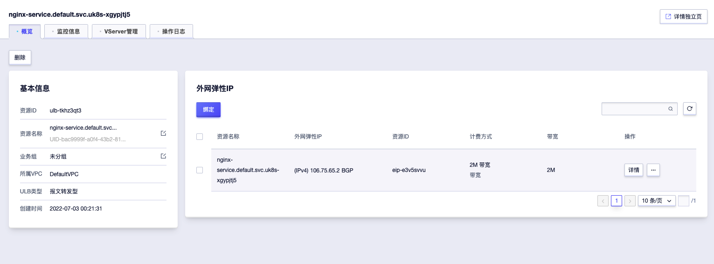
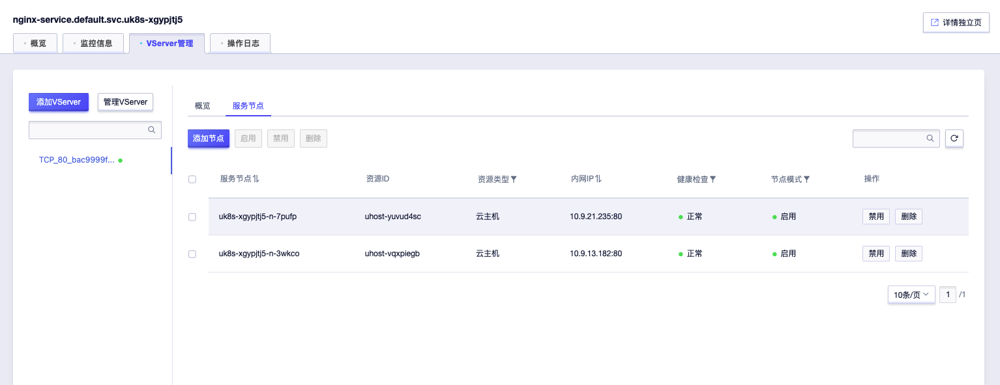

# k8s容器网络 Service和iptables

在k8s架构中，Pod并不适合直接作为服务暴露出去，因为编排器可能随时对Pod进行创建和销毁操作，k8s提供了Service作为负载均衡器来动态地访问上游Pod服务。

只要我们想把服务暴露出去，不管是提供给内部服务使用，还是给外部前端调用，都或多或少创建和使用过Service，我在工作中因为接触到CNI插件以及容器云CloudProvider的维护，所以需要接触一些Service底层调试，因此写了这篇文章来简单地记录一下我调试Service的过程。

## 背景和准备

注意，本文重点在于基于iptables的Service实现原理，所有实验都是用IP进行的，略过关于DNS的部分。

另外，本文的前提是kube-proxy使用`iptables`代理模式，别的代理模式不在本文讨论范围，详细可以参考[官方文档](https://kubernetes.io/docs/concepts/services-networking/service/#configuration)。在`iptables`代理模式下，负载均衡的实现是通过`NAT iptables`规则来实现的，在创建和修改Service的时候，kube-proxy会在node上面修改iptables规则，从而确保流量被转发到正确的Pod上面。

使用iptables的好处是，iptables是Linux提供的网络功能，流量由Linux netfilter处理，而不经过kube-proxy，这使得流量处理更加高效，并且当kube-proxy挂掉之后，也不会导致流量中断。

kube-proxy中关于iptables规则的代码实现可以在[pkg/proxy/iptables/proxier.go](https://github.com/kubernetes/kubernetes/blob/master/pkg/proxy/iptables/proxier.go)中找到，如果调试过程中有疑问，可以在这里查看源代码实现。

为了方便演示，我们创建一个简单的Pod：

```yaml
apiVersion: v1
kind: Pod
metadata:
  name: nginx
  namespace: default
  labels:
    app: nginx
spec:
  containers:
  - name: nginx
    image: nginx:stable
    ports:
      - containerPort: 80
        name: http-web-svc
```

## NodePort模式

NodePort是Service的一种服务暴露模式，它将Service暴露在节点的某一个端口上。k8s默认会为每个Service在`30000-32767`端口范围选择一个端口，例如30000，这样我们就可以通过`<node-ip>:30000`来访问这个服务了。

我们创建一个NodePort Service来暴露上面的Pod：

```yaml
apiVersion: v1
kind: Service
metadata:
  name: nginx-service
  namespace: default
spec:
  type: NodePort
  selector:
    app: nginx
  ports:
    - port: 80
      targetPort: 80
      nodePort: 30008
```

我们在Service中指定了NodePort为`30008`，如果不指定，k8s会为我们自动分配一个。

我们的测试集群有两个节点，观察一下Nginx运行的节点：

```shell
$ kubectl get nodes
NAME           STATUS                     ROLES    AGE     VERSION
10.9.112.133   Ready,SchedulingDisabled   master   8m55s   v1.22.5
10.9.121.211   Ready,SchedulingDisabled   master   8m35s   v1.22.5
10.9.13.182    Ready                      <none>   8m23s   v1.22.5
10.9.21.235    Ready                      <none>   8m11s   v1.22.5
10.9.34.135    Ready,SchedulingDisabled   master   8m57s   v1.22.5

$ kubectl get -n default pods/nginx -o yaml
...
spec:
  nodeName: 10.9.21.235
```

可以看到Pod运行在其中一个节点上，为了验证，我们访问另外一个节点`10.9.13.182`的`30008`端口：

```shell
$ curl http://10.9.13.182:30008/
...
<h1>Welcome to nginx!</h1>
...
```

可以看到，虽然Pod部署在`10.9.21.235`上面，但是我们仍然可以通过别的节点的NodePort来访问Pod，下面，我们登陆到任一节点上面，来深入观察iptables是如何配置的。

kube-proxy会在`nat table`上面创建规则，我们首先来看`PREROUTING chain`：

```shell
$ iptables -t nat -L PREROUTING | column -t
Chain          PREROUTING  (policy  ACCEPT)
target         prot        opt      source    destination
KUBE-SERVICES  all         --       anywhere  anywhere     /*  kubernetes  service  portals  */
```

可以看到所有请求都被路由到了`KUBE-SERVICES chain`上面，继续来看这个chain：

```shell
$ iptables -t nat -L KUBE-SERVICES -n  | column -t
Chain                      KUBE-SERVICES  (2   references)
target                     prot           opt  source       destination
KUBE-SVC-TCOU7JCQXEZGVUNU  udp            --   0.0.0.0/0    172.17.0.2      /*  kube-system/kube-dns:dns                cluster  IP          */     udp   dpt:53
KUBE-SVC-ERIFXISQEP7F7OF4  tcp            --   0.0.0.0/0    172.17.0.2      /*  kube-system/kube-dns:dns-tcp            cluster  IP          */     tcp   dpt:53
KUBE-SVC-JD5MR3NA4I4DYORP  tcp            --   0.0.0.0/0    172.17.0.2      /*  kube-system/kube-dns:metrics            cluster  IP          */     tcp   dpt:9153
KUBE-SVC-V2OKYYMBY3REGZOG  tcp            --   0.0.0.0/0    172.17.109.252  /*  default/nginx-service                   cluster  IP          */     tcp   dpt:80
KUBE-SVC-PXV2QMJJXS64UMIW  tcp            --   0.0.0.0/0    172.17.78.250   /*  kube-system/csi-udisk-controller:dummy  cluster  IP          */     tcp   dpt:12345
KUBE-SVC-FAVQER6QA5VKQH2Z  tcp            --   0.0.0.0/0    172.17.124.81   /*  kube-system/csi-ufile-controller:dummy  cluster  IP          */     tcp   dpt:12345
KUBE-SVC-QMWWTXBG7KFJQKLO  tcp            --   0.0.0.0/0    172.17.58.138   /*  kube-system/metrics-server              cluster  IP          */     tcp   dpt:443
KUBE-SVC-NPX46M4PTMTKRN6Y  tcp            --   0.0.0.0/0    172.17.0.1      /*  default/kubernetes:https                cluster  IP          */     tcp   dpt:443
KUBE-NODEPORTS             all            --   0.0.0.0/0    0.0.0.0/0       /*  kubernetes                              service  nodeports;  NOTE:  this  must       be  the  last  rule  in  this  chain  */  ADDRTYPE  match  dst-type  LOCAL
```

NodePort请求会走到最后一个`KUBE-NODEPORTS chain`，这是实现NodePort转发的关键，继续查看这个chain：

```shell
$ iptables -t nat -L KUBE-NODEPORTS -n  | column -t
Chain                      KUBE-NODEPORTS  (1   references)
target                     prot            opt  source       destination
KUBE-SVC-V2OKYYMBY3REGZOG  tcp             --   0.0.0.0/0    0.0.0.0/0    /*  default/nginx-service  */  tcp  dpt:30008
```

kube-proxy会为每个Service在这里创建一个chain并指定对应的NodePort，我们可以在这里看到我们配置的NodePort`dpt:30008`，说明该NodePort的请求会被转发到`KUBE-SVC-V2OKYYMBY3REGZOG chain`上面，继续进行解析：

```shell
$ iptables -t nat -L KUBE-SVC-V2OKYYMBY3REGZOG -n  | column -t
Chain                      KUBE-SVC-V2OKYYMBY3REGZOG  (2   references)
target                     prot                       opt  source       destination
KUBE-MARK-MASQ             tcp                        --   0.0.0.0/0    0.0.0.0/0    /*  default/nginx-service  */  tcp  dpt:30008
KUBE-SEP-FBTI4PUK7BCWVANV  all                        --   0.0.0.0/0    0.0.0.0/0    /*  default/nginx-service  */

$ iptables -t nat -L KUBE-SEP-FBTI4PUK7BCWVANV -n  | column -t
Chain           KUBE-SEP-FBTI4PUK7BCWVANV  (1   references)
target          prot                       opt  source       destination
KUBE-MARK-MASQ  all                        --   10.9.121.52  0.0.0.0/0    /*  default/nginx-service  */
DNAT            tcp                        --   0.0.0.0/0    0.0.0.0/0    /*  default/nginx-service  */  tcp  to:10.9.121.52:80
```

在上面两个chain中，都存在`KUBE-MARK-MASQ`规则，这个规则会标记需要修改数据包，以在`POSTROUTING chain`的最后利用DNAT将源IP修改为node的地址。

在`KUBE-SEP-FBTI4PUK7BCWVANV`中，可以看到利用`DNAT`规则将请求到NodePort端口的数据包的目标地址重写为`10.9.121.52:80`这是我们nginx Pod的地址，我们可以验证一下：

```shell
$ kubectl get -n default pods/nginx -o yaml
...
status:
  podIP: 10.9.121.52
...
```

接下来，利用容器网络，请求就可以正确被转发到对应的Pod上面。

下面，我们来验证一下当Pod发生改变时，iptables规则是否会被正确修改。

我们部署一个新的nginx Pod，并特意将其部署在另外一个node上面：

```yaml
apiVersion: v1
kind: Pod
metadata:
  name: nginx-2
  namespace: default
  labels:
    app: nginx
spec:
  nodeSelector:
    kubernetes.io/hostname: 10.9.13.182
  containers:
  - name: nginx
    image: nginx:stable
    ports:
      - containerPort: 80
        name: http-web-svc
```

来看一下表示Service的chain`KUBE-SVC-V2OKYYMBY3REGZOG`：

```shell
$ iptables -t nat -L KUBE-SVC-V2OKYYMBY3REGZOG -n  | column -t
Chain                      KUBE-SVC-V2OKYYMBY3REGZOG  (2   references)
target                     prot                       opt  source       destination
KUBE-MARK-MASQ             tcp                        --   0.0.0.0/0    0.0.0.0/0    /*  default/nginx-service  */  tcp        dpt:30008
KUBE-SEP-FBTI4PUK7BCWVANV  all                        --   0.0.0.0/0    0.0.0.0/0    /*  default/nginx-service  */  statistic  mode       random  probability  0.50000000000
KUBE-SEP-JMLWGAAJ6M2I4CUQ  all                        --   0.0.0.0/0    0.0.0.0/0    /*  default/nginx-service  */
```

可以看到kube-proxy会给每个目标pod创建一个`SEP`规则，并使用random的方式来选取pod，每个pod被请求的几率相等。

可以看一下新的`KUBE-SEP-JMLWGAAJ6M2I4CUQ`，它指向了我们刚刚创建的pod：

```shell
$ iptables -t nat -L KUBE-SEP-JMLWGAAJ6M2I4CUQ -n  | column -t
Chain           KUBE-SEP-JMLWGAAJ6M2I4CUQ  (1   references)
target          prot                       opt  source       destination
KUBE-MARK-MASQ  all                        --   10.9.163.55  0.0.0.0/0    /*  default/nginx-service  */
DNAT            tcp                        --   0.0.0.0/0    0.0.0.0/0    /*  default/nginx-service  */  tcp  to:10.9.163.55:80
```

简单总结一下：

- kube-proxy本身不负责数据包的转发，它只进行iptables规则的配置，具体转发由iptables完成。
- 转发是在`PREROUTING`chain完成的，并通过DNAT修改数据包来实现流量的转发。

这里可能会有人有疑问，假如NodePort在节点上被别的应用占用了，流量还能不能被正确转发到Pod上面，还是会被转发到这个应用上面。

有一个有趣的现象是，kube-proxy自己会监听NodePort：

```shell
$ lsof -i:30008
COMMAND    PID USER   FD   TYPE DEVICE SIZE/OFF NODE NAME
kube-prox 9282 root   12u  IPv4 130530      0t0  TCP *:30008 (LISTEN)
```

而请求根本不会走到这里，因为rewrite是在PREROUTING阶段完成的，在路由前就完成了对数据包的重定向，这也是为什么kube-proxy把规则全部定义在了PREROUTING chain中。

## ClusterIP模式

ClusterIP模式下的iptables规则配置方式其实和NodePort是差不多的。只不过ClusterIP用的是由k8s分配的一个VIP，一般只用于集群内部使用。

我们来创建一个ClusterIP模式的Service：

```yaml
apiVersion: v1
kind: Service
metadata:
  name: nginx-service
  namespace: default
spec:
  type: ClusterIP
  selector:
    app: nginx
  ports:
    - port: 80
      targetPort: 80
```

k8s会给这个Service分配一个ClusterIP(VIP)，我们可以通过这个IP来访问Service，可以在创建之后查看ClusterIP：

```shell
$ kubectl get -n default svc/nginx-service -o yaml
...
spec:
  clusterIP: 172.17.131.50
```

在集群内，可以通过这个IP来访问Service：

```shell
$ curl http://172.17.131.50:80
...
<title>Welcome to nginx!</title>
...
```

来看一下`KUBE-SERVICES chain`：

```shell
$ iptables -t nat -L KUBE-SERVICES -n  | column -t
Chain                      KUBE-SERVICES  (2   references)
target                     prot           opt  source       destination
KUBE-SVC-TCOU7JCQXEZGVUNU  udp            --   0.0.0.0/0    172.17.0.2     /*  kube-system/kube-dns:dns                cluster  IP          */     udp   dpt:53
KUBE-SVC-ERIFXISQEP7F7OF4  tcp            --   0.0.0.0/0    172.17.0.2     /*  kube-system/kube-dns:dns-tcp            cluster  IP          */     tcp   dpt:53
KUBE-SVC-JD5MR3NA4I4DYORP  tcp            --   0.0.0.0/0    172.17.0.2     /*  kube-system/kube-dns:metrics            cluster  IP          */     tcp   dpt:9153
KUBE-SVC-V2OKYYMBY3REGZOG  tcp            --   0.0.0.0/0    172.17.131.50  /*  default/nginx-service                   cluster  IP          */     tcp   dpt:80
KUBE-SVC-PXV2QMJJXS64UMIW  tcp            --   0.0.0.0/0    172.17.78.250  /*  kube-system/csi-udisk-controller:dummy  cluster  IP          */     tcp   dpt:12345
KUBE-SVC-FAVQER6QA5VKQH2Z  tcp            --   0.0.0.0/0    172.17.124.81  /*  kube-system/csi-ufile-controller:dummy  cluster  IP          */     tcp   dpt:12345
KUBE-SVC-QMWWTXBG7KFJQKLO  tcp            --   0.0.0.0/0    172.17.58.138  /*  kube-system/metrics-server              cluster  IP          */     tcp   dpt:443
KUBE-SVC-NPX46M4PTMTKRN6Y  tcp            --   0.0.0.0/0    172.17.0.1     /*  default/kubernetes:https                cluster  IP          */     tcp   dpt:443
KUBE-NODEPORTS             all            --   0.0.0.0/0    0.0.0.0/0      /*  kubernetes                              service  nodeports;  NOTE:  this  must       be  the  last  rule  in  this  chain  */  ADDRTYPE  match  dst-type  LOCAL
```

这次，因为我们是用ClusterIP请求的，所以请求会走到`KUBE-SVC-V2OKYYMBY3REGZOG chain`，来继续查看一下：

```shell
$ iptables -t nat -L KUBE-SVC-V2OKYYMBY3REGZOG -n  | column -t
Chain                      KUBE-SVC-V2OKYYMBY3REGZOG  (1   references)
target                     prot                       opt  source       destination
KUBE-SEP-FBTI4PUK7BCWVANV  all                        --   0.0.0.0/0    0.0.0.0/0    /*  default/nginx-service  */  statistic  mode  random  probability  0.50000000000
KUBE-SEP-JMLWGAAJ6M2I4CUQ  all                        --   0.0.0.0/0    0.0.0.0/0    /*  default/nginx-service  */
```

可以看到规则跟前面的NodePort是一样的，这里不再赘述。

## LoadBalancer模式

这是一种特殊的模式，是通过云供应商提供的LoadBalance服务来实现负载均衡。这一般用于云供应商提供的k8s集群中。例如AWS，Azure等云厂商提供的k8s服务。这样，就无需IngressController就可以把服务暴露给外部使用。

这次，我们以UCloud为例，创建一个LoadBalancer类型的Service(注意，这一般会在云厂商产生计费，请参考相应文档)：

```yaml
apiVersion: v1
kind: Service
metadata:
  name: nginx-service
  namespace: default
spec:
  type: LoadBalancer
  selector:
    app: nginx
  ports:
    - port: 80
      targetPort: 80
```

在UCloud控制台，可以看到CloudProvider会自动为我们创建负载均衡器：



这个负载均衡器会指向集群的node：



这样，我们在外部就可以通过EIP(外网弹性IP)来访问这个Service了：

```shell
$ curl http://106.75.65.2:80
...
<title>Welcome to nginx!</title>
...
```

注意，UCloud中负载均衡器指向的服务节点是node的80端口，kube-proxy会将这个请求转发的pod上面，我们再来查看一下规则：

```shell
$ iptables -t nat -L KUBE-SERVICES -n  | column -t
Chain                      KUBE-SERVICES  (2   references)
target                     prot           opt  source       destination
KUBE-SVC-QMWWTXBG7KFJQKLO  tcp            --   0.0.0.0/0    172.17.58.138  /*  kube-system/metrics-server              cluster       IP          */     tcp   dpt:443
KUBE-SVC-NPX46M4PTMTKRN6Y  tcp            --   0.0.0.0/0    172.17.0.1     /*  default/kubernetes:https                cluster       IP          */     tcp   dpt:443
KUBE-SVC-TCOU7JCQXEZGVUNU  udp            --   0.0.0.0/0    172.17.0.2     /*  kube-system/kube-dns:dns                cluster       IP          */     udp   dpt:53
KUBE-SVC-ERIFXISQEP7F7OF4  tcp            --   0.0.0.0/0    172.17.0.2     /*  kube-system/kube-dns:dns-tcp            cluster       IP          */     tcp   dpt:53
KUBE-SVC-JD5MR3NA4I4DYORP  tcp            --   0.0.0.0/0    172.17.0.2     /*  kube-system/kube-dns:metrics            cluster       IP          */     tcp   dpt:9153
KUBE-SVC-V2OKYYMBY3REGZOG  tcp            --   0.0.0.0/0    172.17.200.8   /*  default/nginx-service                   cluster       IP          */     tcp   dpt:80
KUBE-FW-V2OKYYMBY3REGZOG   tcp            --   0.0.0.0/0    106.75.65.2    /*  default/nginx-service                   loadbalancer  IP          */     tcp   dpt:80
KUBE-SVC-PXV2QMJJXS64UMIW  tcp            --   0.0.0.0/0    172.17.78.250  /*  kube-system/csi-udisk-controller:dummy  cluster       IP          */     tcp   dpt:12345
KUBE-SVC-FAVQER6QA5VKQH2Z  tcp            --   0.0.0.0/0    172.17.124.81  /*  kube-system/csi-ufile-controller:dummy  cluster       IP          */     tcp   dpt:12345
KUBE-NODEPORTS             all            --   0.0.0.0/0    0.0.0.0/0      /*  kubernetes                              service       nodeports;  NOTE:  this  must       be  the  last  rule  in  this  chain  */  ADDRTYPE  match  dst-type  LOCAL
```

因为EIP是`106.75.65.2`，所以请求会被转发到`KUBE-FW-V2OKYYMBY3REGZOG`这个chain上面，注意它的注释中有`loadbalancer`说明。我们来继续看看：

```shell
$ iptables -t nat -L KUBE-FW-V2OKYYMBY3REGZOG -n  | column -t
Chain                      KUBE-FW-V2OKYYMBY3REGZOG  (1   references)
target                     prot                      opt  source       destination
KUBE-MARK-MASQ             all                       --   0.0.0.0/0    0.0.0.0/0    /*  default/nginx-service  loadbalancer  IP  */
KUBE-SVC-V2OKYYMBY3REGZOG  all                       --   0.0.0.0/0    0.0.0.0/0    /*  default/nginx-service  loadbalancer  IP  */
KUBE-MARK-DROP             all                       --   0.0.0.0/0    0.0.0.0/0    /*  default/nginx-service  loadbalancer  IP  */
```

请求被转发到了`KUBE-SVC-V2OKYYMBY3REGZOG`上面，这个Service的规则跟上面就一样了：

```shell
$ iptables -t nat -L KUBE-SVC-V2OKYYMBY3REGZOG -n  | column -t
Chain                      KUBE-SVC-V2OKYYMBY3REGZOG  (3   references)
target                     prot                       opt  source       destination
KUBE-MARK-MASQ             tcp                        --   0.0.0.0/0    0.0.0.0/0    /*  default/nginx-service  */  tcp        dpt:32129
KUBE-SEP-FBTI4PUK7BCWVANV  all                        --   0.0.0.0/0    0.0.0.0/0    /*  default/nginx-service  */  statistic  mode       random  probability  0.50000000000
KUBE-SEP-JMLWGAAJ6M2I4CUQ  all                        --   0.0.0.0/0    0.0.0.0/0    /*  default/nginx-service  */
```

可见，LoadBalancer类型的区别还是在KUBE-SERVICES中，命中的转发规则是EIP的80端口。这样，外部EIP请求包先被UCloud负载均衡器处理，rewrite到node上面后，再根据iptables规则走到pod上面，中间实际上发生了两次负载均衡。

另外，CloudProvider一般会在Service中写入一些源信息，例如负载均衡器的id，EIP等，这里我们可以简单查看一下：

```shell
$ kubectl get -n default svc/nginx-service -o yaml
apiVersion: v1
kind: Service
metadata:
  annotations:
    service.beta.kubernetes.io/ucloud-load-balancer-id-provision: ulb-tkhz3qt3
  ...
spec:
  allocateLoadBalancerNodePorts: true
  clusterIP: 172.17.200.8
  clusterIPs:
  - 172.17.200.8
  externalTrafficPolicy: Cluster
  internalTrafficPolicy: Cluster
  ipFamilies:
  - IPv4
  ipFamilyPolicy: SingleStack
  ports:
  - nodePort: 32129
    port: 80
    protocol: TCP
    targetPort: 80
  selector:
    app: nginx
  sessionAffinity: None
  type: LoadBalancer
status:
  loadBalancer:
    ingress:
    - ip: 106.75.65.2
```